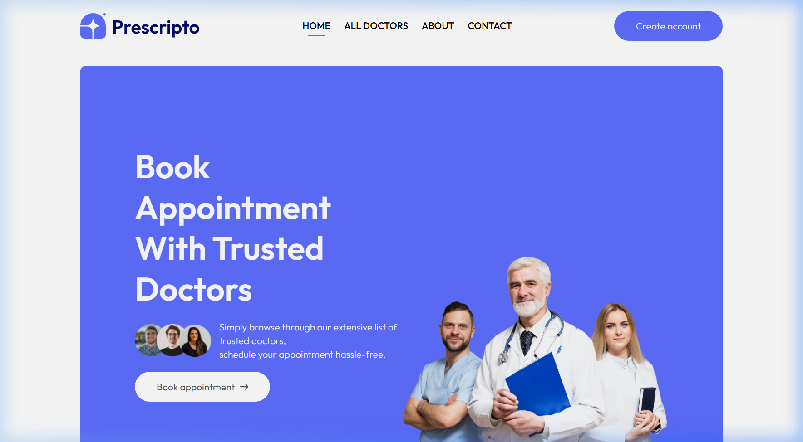

# 🔐 Arun Pratap Singh Bhadoriya — Portfolio

**Full Stack Developer | Cybersecurity Enthusiast**  
*Securing Systems. Building Scalable Applications.*

[](https://react.dev/)
[](https://vitejs.dev/)
[](https://tailwindcss.com/)
[](https://gsap.com/)
[](LICENSE)

> A dark-themed, ATS-optimized, cybersecurity-inspired personal portfolio website built with React, Vite, Tailwind CSS v4, and GSAP animations.

---

## 🌐 Live Demo

🔗 **[View Portfolio →](https://prescripto-swkh.vercel.app/)** *(update with your deployed URL)*

---

## 📸 Preview



---

## ✨ Features

- 🎨 **Cybersecurity Hacker Theme** — Dark background, neon green/blue highlights, Matrix-style animations
- ⚡ **GSAP Animations** — Smooth scroll-triggered animations, glitch effects, and typing effects
- 🔍 **ATS Optimized** — Keyword-rich headings, meta description, semantic HTML for recruiter visibility
- 📱 **Fully Responsive** — Mobile-first design, works on all screen sizes
- 🔗 **Clickable Certifications** — All certificates link directly to Google Drive PDFs
- 🖼️ **Project Showcases** — Live screenshots with hover scanline effects
- 📄 **Resume Access** — Direct link to resume via Google Drive
- 🌀 **Loading Animation** — Enhanced cyberpunk-style initial loading sequence
- 💡 **Cursor Glow** — Custom glowing cursor effect
- 📊 **Scroll Progress Bar** — Animated scroll progress indicator

---

## 🛠️ Tech Stack

| Category       | Technology                    |
|----------------|-------------------------------|
| Framework      | React 18                      |
| Build Tool     | Vite 5                        |
| Styling        | Tailwind CSS v4               |
| Animations     | GSAP + ScrollTrigger          |
| Icons          | Lucide React                  |
| Deployment     | Vercel                        |

---

## 🗂️ Project Structure

```
portfolio/
├── public/
│   ├── images/
│   │   ├── prescripto.png        # Prescripto project screenshot
│   │   └── cpu_scheduler.png     # CPU Scheduler screenshot
│   └── resume.pdf
├── src/
│   ├── components/
│   │   ├── Hero.jsx              # Landing section with glitch animation
│   │   ├── About.jsx             # Professional summary
│   │   ├── Skills.jsx            # Technical skills grid
│   │   ├── Projects.jsx          # Software development projects
│   │   ├── CyberProjects.jsx     # Cybersecurity projects (Coming Soon)
│   │   ├── Experience.jsx        # Education, Certifications & Achievements
│   │   ├── Contact.jsx           # Hacker-style contact form
│   │   ├── Navbar.jsx            # Sticky glowing navbar
│   │   ├── Footer.jsx            # Footer with social links
│   │   ├── MatrixBackground.jsx  # Animated Matrix rain background
│   │   └── Cursor.jsx            # Custom cursor glow
│   ├── App.jsx
│   └── index.css                 # Global styles + Tailwind v4 theme
├── index.html                    # SEO meta tags
└── vite.config.js
```

---

## 🚀 Getting Started

### Prerequisites
- Node.js 18+
- npm or yarn

### Installation

```bash
# Clone the repository
git clone https://github.com/rajputarun1/Portfolio.git
cd Portfolio

# Install dependencies
npm install

# Start development server
npm run dev
```

Open [http://localhost:5173](http://localhost:5173) to view it in your browser.

### Build for Production

```bash
npm run build
```

---

## 📜 Sections

| # | Section | Description |
|---|---------|-------------|
| 01 | **Hero** | Name, roles, glitch animation, CTA buttons |
| 02 | **About** | Professional summary |
| 03 | **Technical Skills** | Languages, frameworks, databases, tools |
| 04 | **Software Development Projects** | Prescripto, CPU Scheduler Simulator |
| 05 | **Cybersecurity Projects** | Coming Soon — AI Phishing, Malware Sandbox, etc. |
| 06 | **System_History** | Education, Certifications, Achievements |
| 07 | **Contact** | Terminal-style hacker contact form + social links |

---

## 📬 Contact

| Platform  | Link |
|-----------|------|
| 📧 Email   | [rajputarunpratapsingh@gmail.com](mailto:rajputarunpratapsingh@gmail.com) |
| 💼 LinkedIn | [linkedin.com/in/rajputarun01](https://www.linkedin.com/in/rajputarun01) |
| 🐙 GitHub  | [github.com/rajputarun1](https://github.com/rajputarun1) |


---

## 📄 License

This project is open source and available under the [MIT License](LICENSE).

---

<p align="center">Built with ❤️ using React & GSAP</p>
